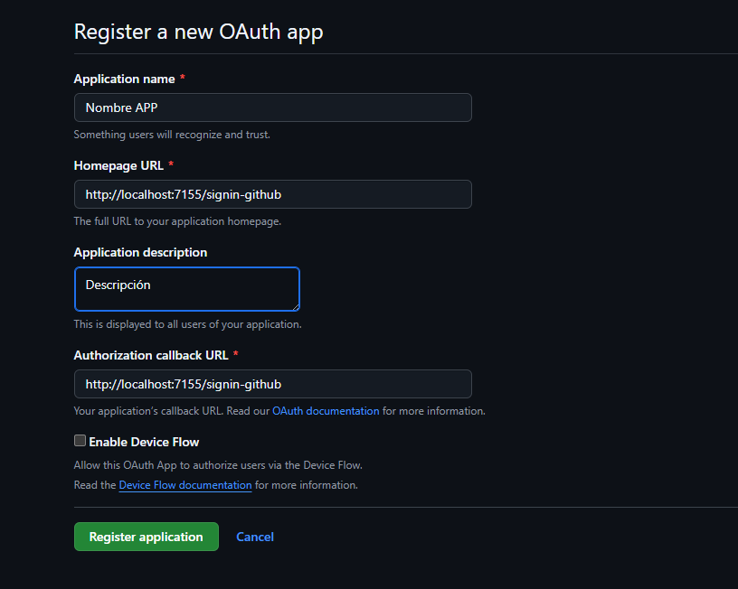
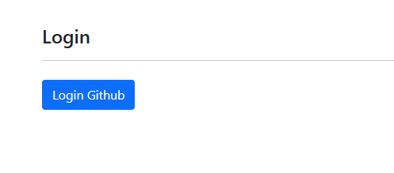
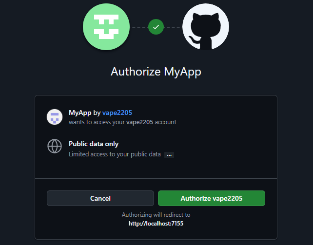

<h1 align="center" id="title">LOGIN CON UN PROVEEDOR EXTERNO(GITHUB)</h1>

<p align="center"></p>

<p id="description">APP Autenticación con Github</p>

  
<h2>🧐 Features</h2>

Caracteristicas

*   La aplicación permite el login con un proveedor externo en este caso Github.

<h2>🛠️ Pasos para la configuración en Github:</h2>

<p>1. Crear un app en Github</p>

* Ingresar al siguiente link https://github.com/settings/applications/new

* Ingresar los parametros segun el app



* Generar el client secret


* Copiar los valores del clientid y client secret en el archivo de configuración

```
# Variables de entorno para la bd 
APP_PORT=7155
GITHUB_CLIENTID= Tu ClientId
GITHUB_CLIENTSECRET=Tu Client Secret
```

<p>2. Ejecutar Docker Compose</p>

```
docker compose up -d --build
```

<h2>🛠️ Installation Steps:</h2>

<p>1. Agregar archivo de environment</p>

Crear un archivo .env en la raiz del proyecto

```
# Variables de entorno para la bd 
APP_PORT=7155
GITHUB_CLIENTID= Tu ClientId
GITHUB_CLIENTSECRET=Tu Client Secret
```

<p>2. Ejecutar Docker Compose</p>

```
docker compose up -d --build
```

<h2>Pasos para probar</h2>

* Seleccionar el boton para el login



* Autorizar al app


  
<h2>💻 Built with</h2>

Tecnologias usadas en este proyecto:

*   ASP .Net Core